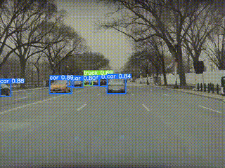

# Einstein_Vision

## Project Overview

This project focuses on the detection and analysis of road scenes in video streams using advanced computer vision techniques and deep learning models. The main objectives include distinguishing between different objects on the road and pedestrians, determining their pose, integrate camera calibration for accurate 3D positioning in a simulated environment to recreate what we see on the Tesla's dashboard.

## Features

- **Vehicle Detection**: Utilize YOLOv8 for real-time vehicle detection.
- **Depth Estimation**: Utilize MiDaS for real-time depth estimation.
- **Vehicle pose estimation**: Utilize YOLO3D for vehicle pose estimation.
- **Human pose estimation**: Utilize YOLOv8 pose model for human pose estimation.
- **Lane Detection**: Utilize Ultrafast Lane detection model for lane detection.
- **Camera Calibration**: Apply camera calibration to convert image coordinates into 3D world coordinates using intrinsic and extrinsic parameters.

## Technologies Used

- **Python**: Primary programming language.
- **OpenCV**: For image processing and optical flow calculations.
- **PyTorch**: Utilized for running the YOLOv8 model for object detection.
- **Blender**: For visualizing the rendered scenes.

## Results

Object Detection wih YOLOv8

Vehicle Pose Estimation wih YOLO3D

Depth map from YOLO3D

Human pose estimation from YOLOv8 pose model

Lane detection from Ultrafast lane detection

Scene Recreation in Blender

